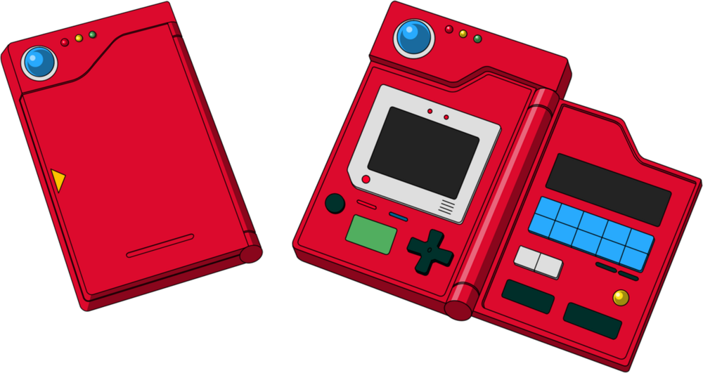

<h3 align="center">
  
  <br>
</h3>
<p align="center">
  <strong>Pokedex</strong> is a personal project to train some Vue js fundamentals and plugins.
</p>

<p align="center">
  <a href="https://github.com/tthheusalmeida/pokedex/blob/main/LICENSE">
    
  </a>
</p>

# 📂 Table of Contents

- [About](#about)
- [Technology](#technology)
- [In Action](#in-action)
- [Getting Started](#getting-started)
- [Project Setup](#project-setup)
  - [Other Commands](#other-commands)
    - [Compiles and minifies for production](#production)
    - [Run your unit tests](#unit-tests)
    - [Lints and fixes files](#lint)
- [How to contribute](#how-to-contribute)
- [License](#license)

<a id="about"></a>

## 📖 About

<strong>Pokedex</strong> is a high-tech portable encyclopedia used in the pokemon world.

Pokemons are like the animals that live in that world.

It is possible to obtain various information about pokemons, such as weight, height, abilities, among others.

The idea is to implement or simulate the one that already exists, using oficial API the <strong>[PokeApi](https://pokeapi.co/)</strong>.

<a id="technology"></a>

## 💡 Technology

The project was developed with the following technologies:

- [Vuejs](https://vuejs.org/) The Progressive
JavaScript Framework
- [Vue Cli](https://cli.vuejs.org/) is a Standard Tooling for Vue.js Development
- [Vuetify](https://vuetifyjs.com/) is a Vue UI Library with beautifully handcrafted Material Components
- [Vuex](https://vuex.vuejs.org/) is a state management pattern and library for Vue.js applications
- [ESLint](https://eslint.org/) statically analyzes your code to quickly find problems
- [Jest](https://jestjs.io/) is a delightful JavaScript Testing Framework with a focus on simplicity
- [HighCharts](https://www.highcharts.com/) for create interactive charts easily for your web projects.

<a id="in-action"></a>

## 📸	In Action

### 📱 Mobile
<div style="display: flex; flex-direction: column; align-items: center; justify-content: center;">
       
</div>

### 🖥️ Desktop
<div style="display: flex; flex-direction: column; align-items: center; justify-content: center;">
       
</div>

<a id="getting-started"></a>

## 🏁 Getting Started

The project is not yet in production, because I want to meet the main features first.

Meanwhile, it can be used locally with the steps below.

<a id="project-setup"></a>

## ⚙️ Project setup
  
First clone the project:
```
git clone git@github.com:tthheusalmeida/pokedex.git
```

Use the command to install the dependencies
```
npm install
```

Run the project
```
npm run serve
```

After the above process is over, go to `http://localhost:8080/` on the browser.

Enjoy!

<a id="other-commands"></a>

### Other Commands

<a id="production"></a>

#### Compiles and minifies for production
```
npm run build
```

<a id="unit-tests"></a>

#### Run your unit tests
```
npm run test:unit
```

<a id="lint"></a>

#### Lints and fixes files
```
npm run lint
```

<a id="how-to-contribute"></a>

## 😃 How to contribute
- First, I leave ⭐ if you liked it!
- Fork this repository.
- Create a branch with the features: `git checkout -b my-feature`
- Commit: `git commit -m 'feat: My new feature'`
- Submit your branch: `git push origin my-feature`

<a id="license"></a>

## 📝 License

This project is under the MIT license. see the [license page](https://opensource.org/licenses/MIT) for more details.


<h4 align="center">
  Made with ❤️ by <a href="https://www.linkedin.com/in/matheus-almeida-602139182/" target="_blank">Matheus Almeida</a>
</h4>